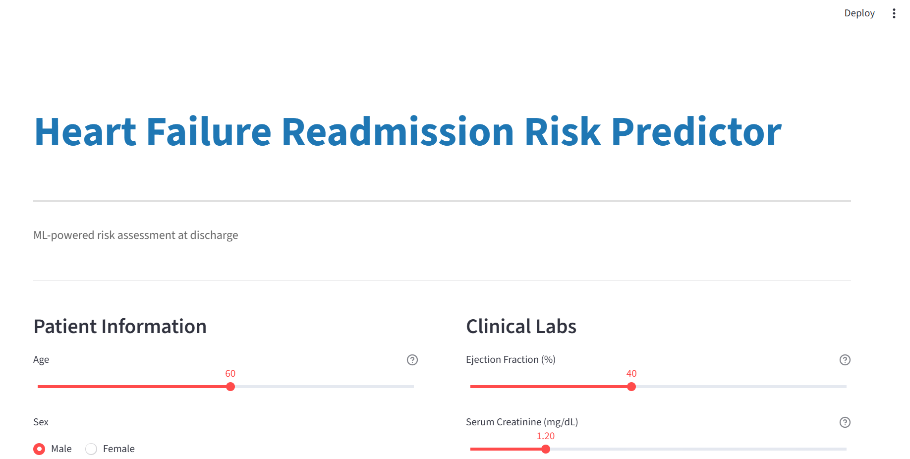
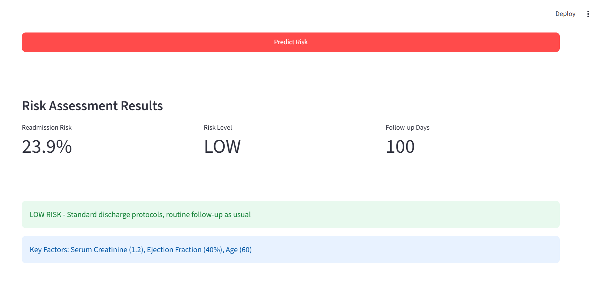

# Heart Failure Readmission Risk Predictor

<div style="display: flex; gap: 20px; justify-content: center;">
  
  
</div>

A machine learning-powered clinical decision support tool that predicts heart failure readmission risk based on patient clinical data.

## Features

- Real-time risk assessment using XGBoost machine learning model
- Clean, professional web interface built with Streamlit
- Interactive patient data entry with clinical validation
- Visual risk indicator with key risk drivers
- Recommendation guidance based on risk level

## Project Overview

This tool is built to help hospitals and clinicians identify high-risk heart failure patients at discharge, enabling proactive interventions to reduce readmission rates.

**Model Performance:**
- Accuracy: 76.67%
- Precision: 78.95%
- Recall: 60.00%
- ROC-AUC: 74.29%

## Installation

### Local Development

1. Clone the repository:
```bash
git clone https://github.com/YOUR_USERNAME/hf-readmission-predictor.git
cd hf-readmission-predictor
```

2. Install dependencies:
```bash
pip install -r requirements.txt
```

3. Download the dataset from Kaggle:
- Go to https://www.kaggle.com/datasets/andrewmvd/heart-failure-clinical-data
- Download `heart_failure_clinical_records.csv`
- Place it in the project directory

4. Run the app:
```bash
streamlit run app.py
```

The app will open at `http://localhost:8501`

## Deployment

### Deploy to Streamlit Cloud (Free)

1. Push your code to GitHub (see steps below)
2. Go to https://share.streamlit.io/
3. Click "New app"
4. Select your repository, branch (`main`), and file (`app.py`)
5. Click "Deploy"

Your app will be live at: `https://hf-readmission-predictor.streamlit.app/`

## Files Included

- `app.py` - Main Streamlit application
- `requirements.txt` - Python dependencies
- `README.md` - This file
- `heart_failure_clinical_records.csv` - Training dataset

## Model Details

The prediction model is an XGBoost classifier trained on 239 heart failure patients with validation on 60 unseen patients.

**Key Features Used:**
- Age
- Ejection Fraction
- Serum Creatinine
- Serum Sodium
- Medical history (diabetes, hypertension, smoking, anaemia)
- Clinical measurements

## Data Source

Dataset: Heart Failure Clinical Records
Source: Kaggle
Records: 299 patients
Features: 13 clinical variables

## License

This project is open source and available for educational and research purposes.

## Disclaimer

This tool is a decision-support system and should not be used as a substitute for clinical judgment. Always consult with qualified healthcare professionals.
